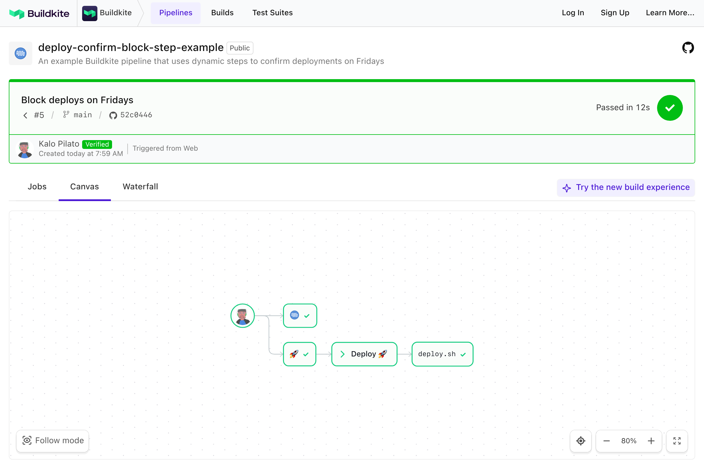
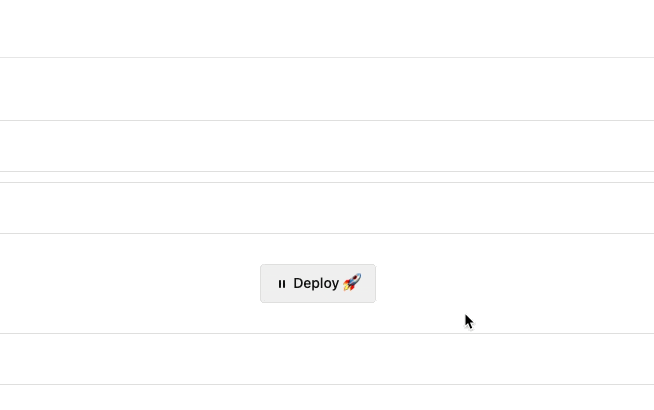
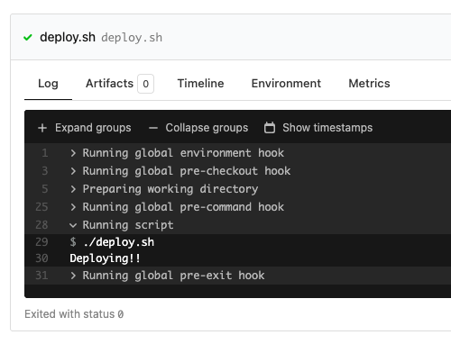
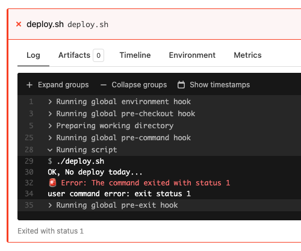

# Buildkite Deploy Confirmation Block Step Example

This repository is an example [Buildkite](https://buildkite.com/) pipeline that shows how to use a [`block` step](https://buildkite.com/docs/pipelines/block-step) to confirm deployments - but only if the `date` command on the agent returns **Friday**.

👉 **See this example in action:** [buildkite/deploy-confirm-block-step-example](https://buildkite.com/buildkite/deploy-confirm-block-step-example/builds/latest?branch=main)

<!-- docs:start -->

## How it works

If the current day is **Friday**, a block step will appear asking for manual deploy confirmation. The user can choose to:

- ✅ **Confirm deploy**
  Respond: `"Yes, I'm sure. If something goes wrong, I'll fix it"`
  → `deploy.sh` runs normally

- ❌ **Cancel deploy**
  Respond: `"Err, nah. I've changed my mind"`
  → `deploy.sh` still runs but exits with a failure

### Block step preview

Here's what the block step looks like:

#### ✅ Confirming

#### ❌ Cancelling

<!-- docs:end -->

## License

See [LICENSE](LICENSE) (MIT)
