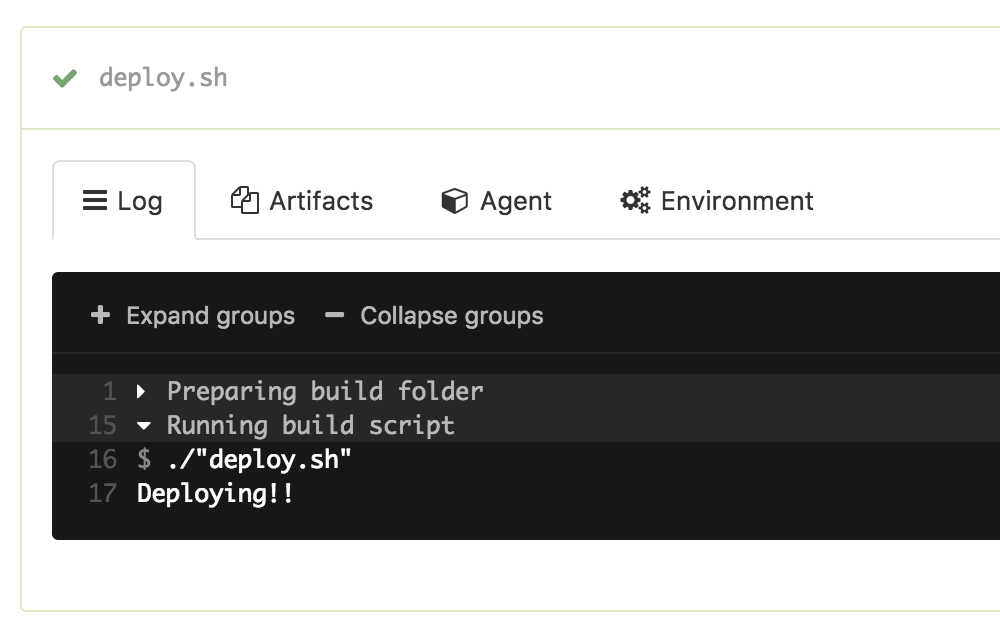

# Deploy Confirmation Block Step Example

This is an example Buildkite pipeline that will show a `block` step for deploys if the `date` command on the agent returns "Friday". Here's what the step looks like:

If you respond with "Yes, I'm sure. If something goes wrong, I'll fix it", it'll run the `deploy.sh` file again but allow the deploy through like usual:

However if you respond with "Err, nah. I've changed my mind", it will still run the `deploy.sh` step, but the build will fail, essentially "blocking" this build from being deployed.

## License

See [LICENCE](LICENCE) (MIT)
