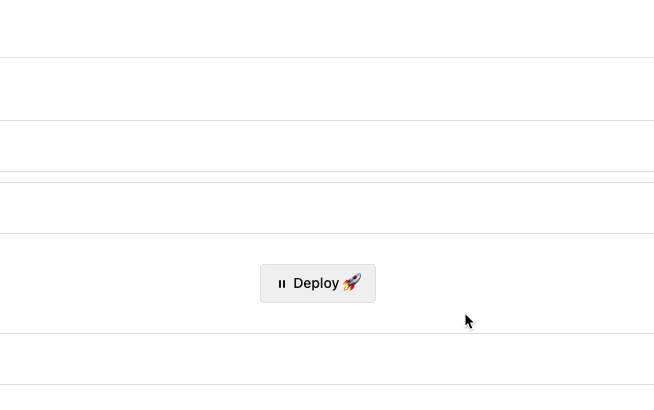
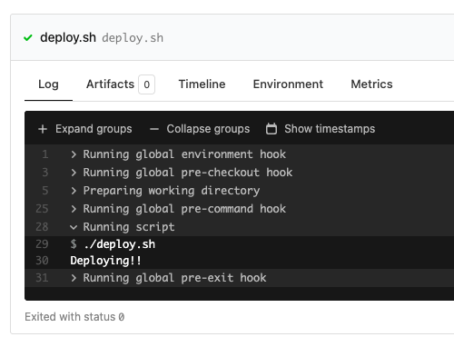

# Deploy Confirmation Block Step Example

This repository is an example [Buildkite](https://buildkite.com/) pipeline that will show a `block` step for deploys if the `date` command on the agent returns "Friday".

👉 **See this example in action:** [buildkite/deploy-confirm-block-step-example](https://buildkite.com/buildkite/deploy-confirm-block-step-example/builds/latest?branch=main)

See the full [Getting Started Guide](https://buildkite.com/docs/guides/getting-started) for step-by-step instructions on how to get this running, or try it yourself:

Here's what the step looks like:

If you respond with "Yes, I'm sure. If something goes wrong, I'll fix it", it'll run the `deploy.sh` file again but allow the deploy through like usual:

However if you respond with "Err, nah. I've changed my mind", it will still run the `deploy.sh` step, but the build will fail, essentially "blocking" this build from being deployed.

## License

See [LICENCE](LICENCE) (MIT)
